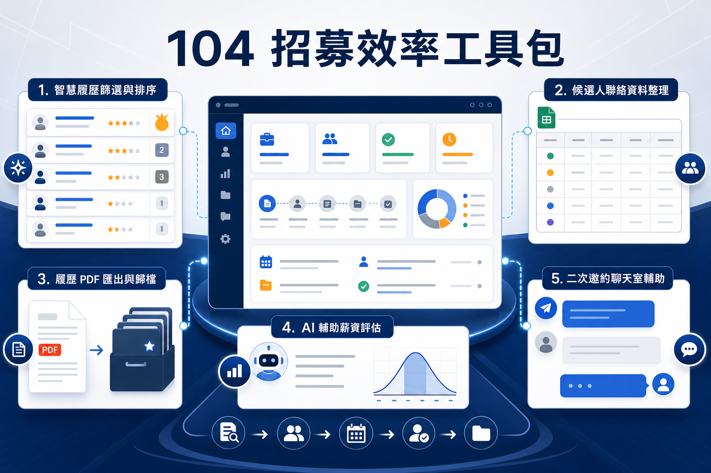

# 104 招募效率工具包

這是一套以 **104 VIP 招募工作流程**為核心所打造的瀏覽器輔助工具集合，涵蓋履歷篩選、資料整理、薪資評估、PDF 歸檔與候選人再次邀約等常見作業。

專案的核心目標，是把大量、重複且容易出錯的人工操作轉化為更快速、一致且可控的流程，讓招募人員能將更多時間投入候選人判斷、溝通與決策。

## 綜合功能

### 1. 履歷智慧篩選與排序

[`104-hide-resume-cards`](./104-hide-resume-cards/)

- 掃描並整理 104 搜尋結果中的候選人卡片。
- 依職務條件、技能、經歷與共用規則進行標示、評分及排序。
- 辨識已有備註或近期曾主動聯絡的候選人，降低重複接觸。
- 標示同業、SI、軟體服務經驗與需人工覆核的風險資訊。
- 支援共用規則，讓團隊維持一致的初步篩選標準。

**效益：** 加速履歷初篩、提高名單聚焦程度，並減少重複聯絡與人工漏看。

### 2. 候選人聯絡資料批次整理

[`104-bunny-extension2.0`](./104-bunny-extension2.0/)

- 擷取履歷中的姓名、E-mail、手機與履歷代碼。
- 支援單頁與多分頁批次收集。
- 將資料整理為可銜接試算表與其他管理工具的結構化格式。
- 自動排除重複履歷，並保留聯絡資訊隱藏狀態。
- 支援批次進度與中途暫停。

**效益：** 降低人工複製與貼表時間，提升資料正確性、完整性與後續整理效率。

### 3. 履歷 PDF 匯出與歸檔

[`104-resume-pdf-exporter(2.0)`](./104-resume-pdf-exporter%282.0%29/)

- 將 104 履歷頁轉換並匯出為 PDF。
- 支援單份與多分頁批次下載。
- 辨識搜尋、預覽、文件及主動應徵等不同履歷來源頁面。
- 支援自訂檔名前綴、後綴與下載分類。
- 提供批次進度、停止控制與成功／失敗狀態。

**效益：** 建立一致的履歷命名與歸檔方式，減少逐份列印、另存與重新命名的重複工作。

### 4. AI 薪資區間預估

[`104-SalaryEstimate`](./104-SalaryEstimate/)

- 擷取候選人的公司、職稱、工作期間與整體年資。
- 結合公司背景、產業規模與工作經歷進行 AI 薪資區間推估。
- 支援不同履歷頁面版型與仍在職年資計算。
- 透過結果快取降低重複分析與不必要的 API 使用。
- 在履歷檢視流程中直接提供薪資判斷參考。

**效益：** 協助招募人員快速形成薪資溝通基準，提升初步評估與邀約決策效率。

> AI 預估結果僅供招募評估參考，仍應搭配市場行情、職務條件、面談資訊與專業判斷。

### 5. 二次邀約與聊天室輔助

[`104-Ivite-again`](./104-Ivite-again/)

- 從履歷代碼查詢結果中辨識已聯絡候選人。
- 分批開啟候選人聊天室，並跳過沒有既有聊天連結的名單。
- 自動擷取候選人姓名並套用二次邀約訊息範本。
- 支援自訂邀約內容與 HR 署名。
- 保留人工確認與手動送出機制。

**效益：** 縮短大量二次邀約的準備時間，同時保留必要的人工作業檢查，降低誤寄風險。

## 工具包帶來的整體效益

| 效益面向 | 帶來的價值 |
|---|---|
| 作業效率 | 減少履歷逐頁開啟、資料複製、PDF 下載與訊息重複輸入 |
| 資料品質 | 統一欄位、命名與輸出格式，降低人工輸入錯誤與重複資料 |
| 篩選品質 | 透過規則、標籤與排序，協助招募人員優先關注適合的人選 |
| 決策支援 | 結合履歷經歷與 AI 薪資評估，提供更完整的初步判斷資訊 |
| 團隊協作 | 共用篩選邏輯與範本，提升多人協作時的一致性 |
| 風險控制 | 保留人工覆核與手動送出環節，避免自動化造成錯誤聯絡 |

## 涵蓋的招募流程

本工具包串接了從人才搜尋到後續聯絡的主要作業節點：

**履歷搜尋與初篩 → 候選人排序 → 聯絡資料整理 → 薪資評估 → PDF 歸檔 → 二次邀約**

各工具可獨立使用，也能依招募情境組合成完整工作流程，協助團隊逐步建立更快速、標準化且可追蹤的招募作業方式。

## 專案定位

- 以減少重複操作、提升招募效率為核心。
- 自動化負責整理與輔助，關鍵決策仍由招募人員完成。
- 工具輸出應搭配人工確認、公司內部流程與個資管理規範。
- 本專案為獨立製作的招募輔助工具，並非 104 官方產品；相關名稱與標識權利歸其權利人所有。
